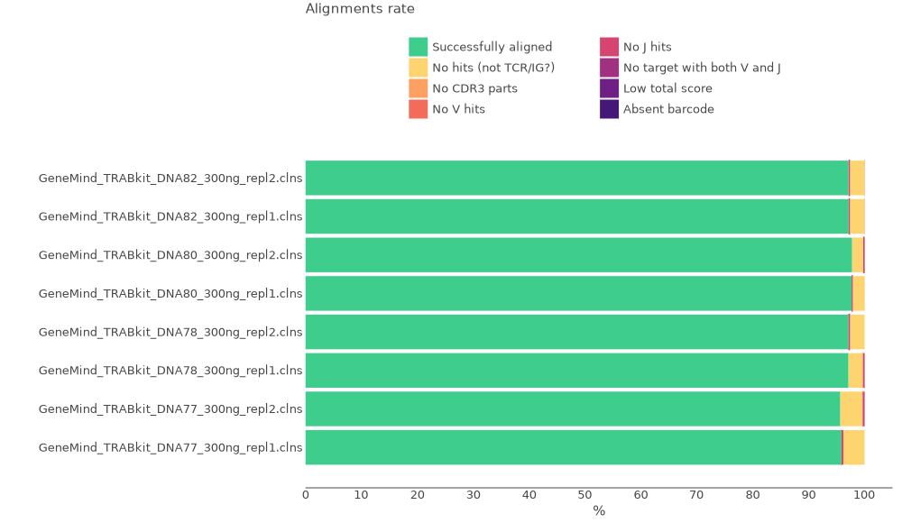
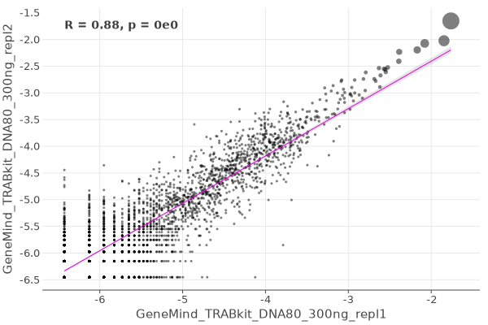
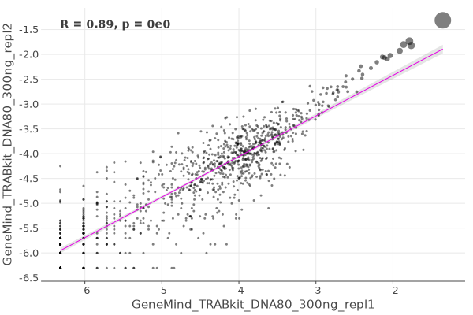
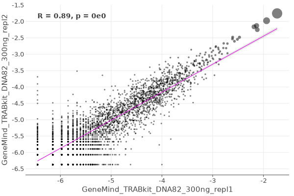

# MiLaboratories Human TCR DNA Multiplex kit

This kit allows to obtain TCR alpha and beta repertoires for different types of available DNA material, with the highest possible sensitivity.

Bellow you can see the structure of cDNA library.


The data for this tutorial consists of four samples. Total DNA was isolated from human PBMC and 300ng were used for each library synthesis. Every sample is present in two technical replicas. DNA libraries were prepared for each sample according to MiLaboratories Human TCR DNA Multiplex kit protocol simultaneously for both TRA and TRB chains. Sequencing was performed on an Illumina NextSeq500 sequencer single-end 150bp reads.

All data may be downloaded using the script bellow.

??? tip "Use [aria2c](https://aria2.github.io) for efficient download of the full dataset with the proper filenames:"
    ```shell title="download.sh"
    --8<-- "milaboratories-human-tcr-dna-multi/scripts/010-download-aria2c.sh"
    ```
    ```shell title="download-list.txt"
    --8<-- "milaboratories-human-tcr-dna-multi/scripts/download-list.txt"
    ```
## Upstream analysis

### One-line solution

MiXCR has a dedicated preset for this protocol, thus analysing the data is as easy as:

```shell
--8<-- "milaboratories-human-tcr-dna-multi/scripts/020-upstream-preset.sh"
```

Running the command above will generate the following files:

```shell
> ls result/

# human-readable reports 
DNA77_repl1.align.report.txt
DNA77_repl1.align.report.json
DNA77_repl1.assemble.report.txt
DNA77_repl1.assemle.report.json
# raw alignments (highly compressed binary file)
DNA77_repl1.vdjca
# TRA, TRB CDR3 clonotypes (highly compressed binary file)
DNA77_repl1.clns
# TRA,TRB CDR3 clonotypes exported in tab-delimited txt
DNA77_repl1.clones_TRAD.tsv
DNA77_repl1.clones_TRB.tsv
```

While `.clns` file holds all data and is used for downstream analysis using [`mixcr postanalisis`](../reference/mixcr-postanalysis.md), the output `.txt` clonotype table will contain exhaustive information about each clonotype as well:

??? tip "See first 100 records from DNA77_repl1.clones_TRAD.tsv clonotype table"
    {{ read_csv('docs/mixcr/guides/milaboratories-human-tcr-dna-multi/figs/DNA77_repl1.clones_TRAD.tsv', engine='python', sep='\t') }}

In order to run the analysis for all samples in the project on Linux we can use [GNU Parallel](https://www.gnu.org/software/parallel/) in the following way:

```shell
--8<-- "milaboratories-human-tcr-dna-multi/scripts/020-upstream-preset-parallel.sh"
```

### Under the hood pipeline

Under the hood `milab-human-tcr-dna-multiplex-cdr3` preset actually executes the following pipeline:

#### `align`
[Alignment](../reference/mixcr-align.md) of raw sequencing reads against reference database of V-, D-, J- and C- gene segments.

```shell
--8<-- "milaboratories-human-tcr-dna-multi/scripts/040-upstream-align.sh"
```

Option `--report` is specified here explicitly.

`--species hsa`
: determines the organism species (hsa for _Homo Sapiens_).

`-p align-legacy-4.0-default`
:  a default preset of MiXCR parameters which includes a dedicated TCR aligner.

`-OvParameters.geneFeatureToAlign="VGeneWithP"`
: Sets a V gene feature to align. Check [gene features](../reference/ref-gene-features.md) for more info.

`-OvParameters.parameters.floatingLeftBound=true`
: Results in a local alignment algorithm for V gene left bound due to the presence of primer sequences.

`-OjParameters.parameters.floatingRightBound=true`
: Results in a local alignment algorithm for J gene right bound due to the presence of primer sequences.


#### `assemble`
[Assembles](../reference/mixcr-assemble.md) clonotypes and applies several layers of errors correction:

- quality-dependent correction for sequencing errors
- PCR-error correction by clustering
- UMI-based error correction)

Check [`mixcr assemble`](../reference/mixcr-assemble.md) for more information.


```shell
--8<-- "milaboratories-human-tcr-dna-multi/scripts/050-upstream-assemble.sh"
```

Options `--report` and `--json-report` are specified here explicitly so that the report files will be appended with assembly report.

`-OassemblingFeatures=CDR3`
: By default `qiaseq-human-tcr-cdr3` preset assembles clones by `CDR3` sequence.

#### `export`
Exports clonotypes from .clns file into human-readable tables.

```shell
--8<-- "milaboratories-human-tcr-dna-multi/scripts/060-upstream-exportClones.sh"
```

## Quality control

Now when we have all files processed lets perform Quality Control. That can be easily done using [`mixcr exportQc`](../reference/mixcr-exportQc.md)
function.

First we will look at the alignment report:

```shell
--8<-- "milaboratories-human-tcr-dna-multi/scripts/080-qc-align.sh"
```



`--absolute-values`
: this parameter leads to absolute reads numbers instead of relative fractions of total number by default.

From this plot we can tell that all samples have high alignment rate, almost all reads each sample have been successfully aligned to the reference sequences and CDR3 has been established. Most replicas have similar number of total reads. But for DNA77 first replica has a significantly lower amount of reads then the second one. We should take this into account before we compare replicas between each other.

Now we can check chain distribution plot:

```shell
--8<-- "milaboratories-human-tcr-dna-multi/scripts/120-qc-chainUsage.sh"
```


Every sample consist of TCR alpha and TCR beta chains. The ratio is equal between the samples regardles off the number of reads per sample.

## Replicas comparison

Since we have two replicas for every sample we can perform a pairwise comparison to check results reproducibility. We will use [`mixcr overlapScatterPlot`](../reference/mixcr-overlapScatterPlot.md).

```shell
--8<-- "milaboratories-human-tcr-dna-multi/scripts/121-overlapScatterPlot.sh"
```
`--chains TRA,TRB`
: here we specify the chains. For every chain a separate plot will be generated.

`--downsampling none`
: we do not perform any downsampling yet, because we want to compare the raw samples.

`--criteria "CDR3|NT|V|J"`
: clones are treated equal if they share `CDR3` nucleotide sequence, V and J genes.

`--no-log`
: to see the overall trend wi will not apply log10 to clonotype frequencies.

Bellow you can see the figures obtained for all pairs:

=== "DNA77_TRA"
    
=== "DNA77_TRB" 
    
=== "DNA78_TRA" 
    
=== "DNA78_TRB" 
    
=== "DNA80_TRA" 
    
=== "DNA80_TRB" 
    
=== "DNA82_TRA" 
    
=== "DNA82_TRB" 
    

A high correlation values are observed for all pairs of replicas.

Finally, we will investigate the number of unique clonotypes and diversity metrics between the samples.

```shell
--8<-- "milaboratories-human-tcr-dna-multi/scripts/122-mixcr-postanalysis-individual.sh"
```

`--default-downsampling count-reads-min`
: we downsample all data to the number of reads in the smallest sample to level out sequencing bias.

`--default-weight-function read`
: weight of every clone is defined as the number of clones.

`--tables pa/pa.i.tsv`
: tabular results output path.

`--preproc-tables pa/preproc.i.tsv`
: output path for the [preprocessing summary tables](../reference/mixcr-postanalysis.md#preprocessing-summary-tables).

Bellow you can see the diversity metrics tables for both chains:

??? tip "TRA diversity"
    {{ read_csv('docs/mixcr/guides/milaboratories-human-tcr-dna-multi/figs/pa.i.diversity.TRA.tsv', engine='python', sep='\t') }}

??? tip "TRB diversity"
    {{ read_csv('docs/mixcr/guides/milaboratories-human-tcr-dna-multi/figs/pa.i.diversity.TRB.tsv', engine='python', sep='\t') }}


## Reports
Finally, MiXCR provides a very convenient way to look at the reports generated at ech step. Every `.vdjca`, `.clns` and `.clna` file holds all the reports for every MiXCR function that has been applied to this sample. E.g. in our case `.clns` file contains reports for `mixcr align` and `mixcr assemble`. To output this report use [`mixcr exportReports`](../reference/mixcr-exportReports.md) as shown bellow. Note `--json` parameter will output a JSON-formatted report.

```shell
--8<-- "milaboratories-human-tcr-rna-multi/scripts/125-qc-exportReports.sh"
```

```shell
--8<-- "milaboratories-human-tcr-rna-multi/scripts/125-qc-exportReports-json.sh"
```

??? "Show report file"
    === "`.txt`"
        ```shell
        --8<-- "milaboratories-human-tcr-dna-multi/figs/DNA77_repl1.report.json"
        ```
    === "`.json`"
        ```json
        --8<-- "milaboratories-human-tcr-dna-multi/figs/DNA77_repl1.report.json"
        ```