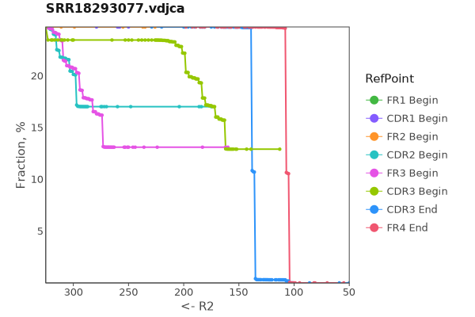
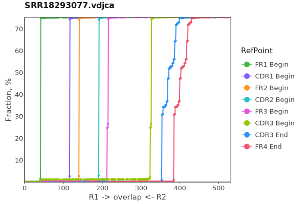

# `mixcr exportQc`

Exports various quality control metrics in a graphical form. Supported file formats: PDF, EPS, SVG, PNG and JPEG.

## Alignment reports
```
mixcr exportQc align \
    [--absolute-values] \ 
    sample1.(vdjca|clns|clna)... \
    aligQc.(pdf|eps|svg|png|jpg)  
```
Exports [alignment reports](report-align.md). Example:

```
mixcr exportQc align *.vdjca alignQc.pdf
```


## Reads coverage
```
mixcr exportQc coverage \
    [--show-boundaries] \
    alignments.vdjca \
    coverage.(pdf|eps|svg|png|jpg)  
```
Exports [anchor points](geneFeatures.md) coverage by the library. It separately plots coverage for R1, R2 and overlapping reads.

Example:

```shell
mixcr exportQc coverage SRR18293077.vdjca coverage.pdf
```

=== "R1"
    <figure markdown>
    
    </figure>
=== "R2"
    <figure markdown>
    
    </figure>
=== "Overlap"
    <figure markdown>
    
    </figure>

## Chain usage
```
mixcr exportQc chainUsage \
    [--absolute-values] \
    [--chains <chains>]... \
    [--hide-non-functional] \
    sample1.(vdjca|clns|clna)... \
    chainUsage.(pdf|eps|svg|png|jpg)  
```
Exports chain usage summary in either alignments (`.vdjca`) or clonotypes (`.clns`). Command line options are: 

`--absolute-values`
: show absolute values instead of percentage

`--chains <chains>`
: specify which chains to export. Possible values: TRAD, TRB, TRG, IGH, IGK, IGL. 

`--hide-non-functional`
: hide fractions of non-functional CDR3s (out-of-frames and containing stops)

Example:
```shell
> mixcr exportQc chainUsage --hide-non-functional results/*.clns chainUsage.pdf 
```
<figure markdown>

</figure>
