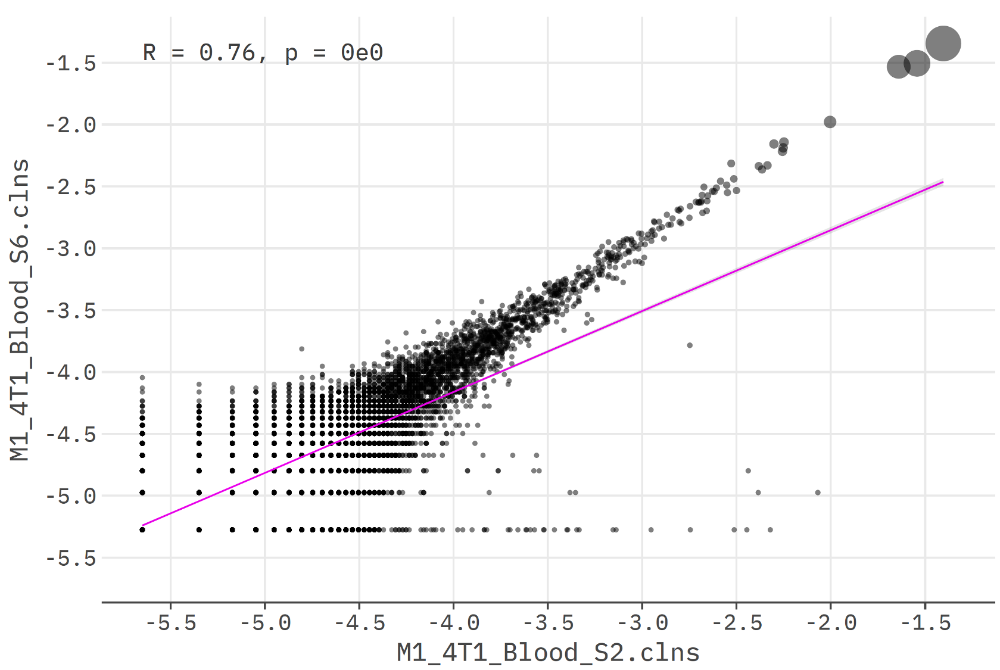

# `mixcr overlapScatterPlot`

`mixcr overlapScatterPlot` creates a scatter-plot for clone frequencies overlap between two samples.


## Command line options

```shell
> mixcr overlapScatterPlot [-f] [--no-log] 
    [-nw] [--only-productive] 
    [--verbose] 
    [--criteria <overlapCriteria>] 
    --downsampling <downsampling> 
    [--method <method>] [--chains <chains>]
    ... 
    <in1> <in2> <out>
```

The command takes `.clna` or `.clns` file as input and produces one of the following graphical formats depending on the extension of output file: `.pdf`, `.eps`, `.png`, `.svg` and `.jpeg`

`-f, --force-overwrite`
: Force overwrite of output file(s).

`--no-log`
: Do not apply log10 to clonotype frequencies.

`--only-productive`
: Filter out-of-frame sequences and sequences with stop-codons.

`--downsampling <downsampling>`
: Choose downsampling. Possible values: `none`,  `count-[reads|TAG]-[auto|min|fixed][-<number>]`, `top-[reads|TAG]-[<number>]`, `cumtop-[reads|TAG]-[percent]`. Check [mixcr postanalysis downsampling](mixcr-postanalysis.md#downsampling) for more information.

`--method <method>`
: Correlation method to use. Possible value: `pearson`, `kendal`, `spearman`.

`--criteria <overlapCriteria>`
: Overlap criteria. Defines the rules to treat clones as equal. Default `CDR3|AA|V|J` (For two clones to me equal they must share `CDR3` amino acid sequence, V and J genes)

`--chains <chains>`
: Chains to export

`-nw, --no-warnings`
: Suppress all warning messages.

`--verbose`
: Verbose warning messages.

Example:

```shell
> mixcr overlapScatterPlot \
    --downsampling none \
    --chains IGH \
    results/M1_4T1_Blood_S2.clns results/M1_4T1_Blood_S6.clns \
    M1_4T1_Blood.overlap.pdf
```

